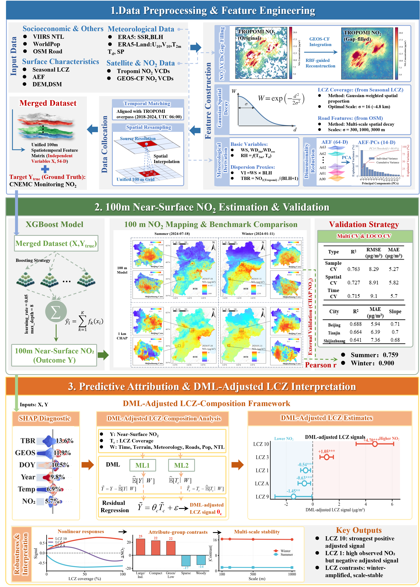
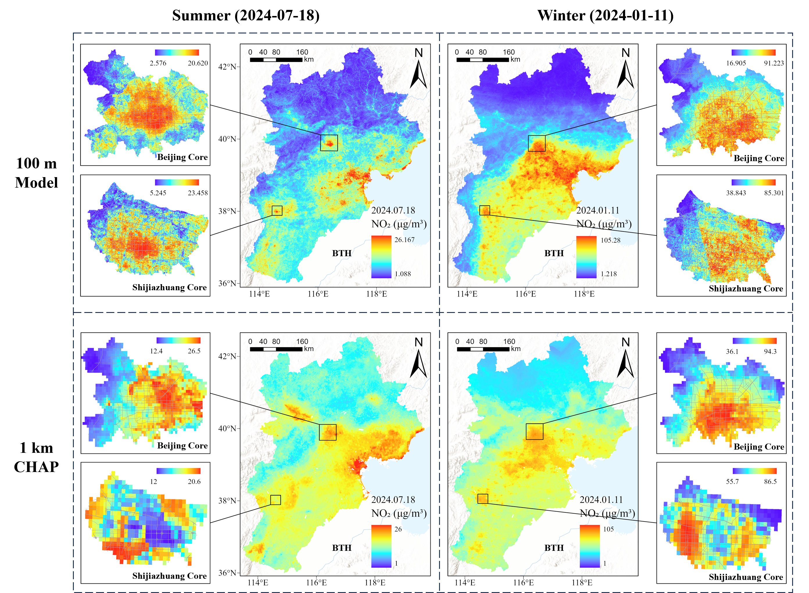
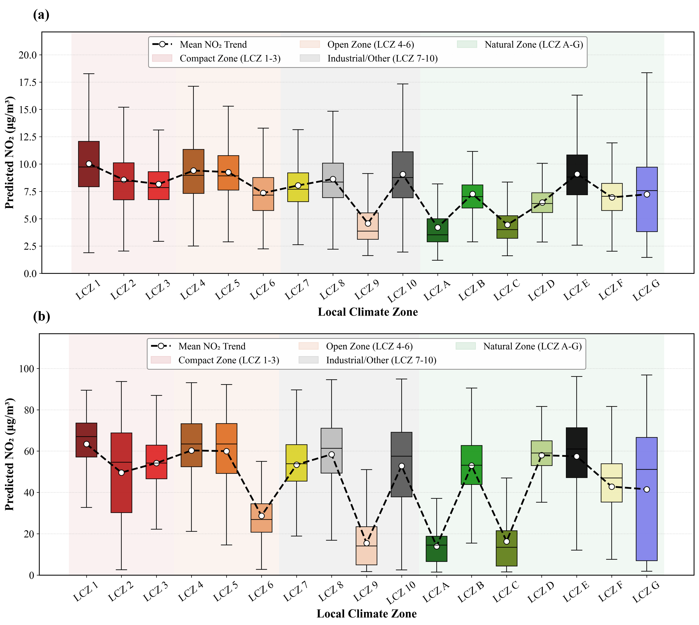
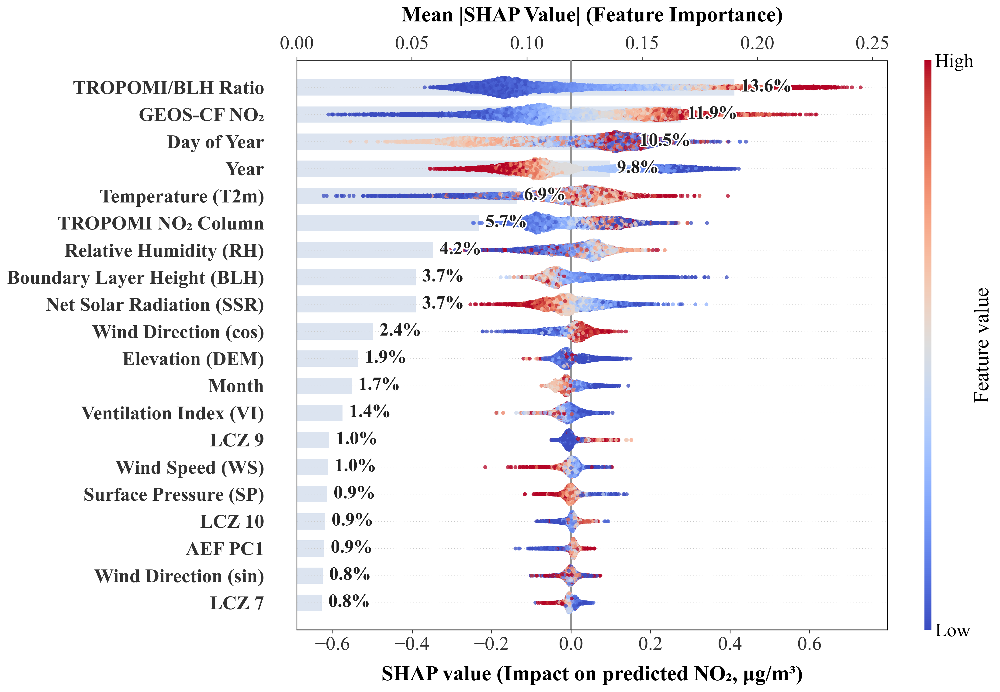
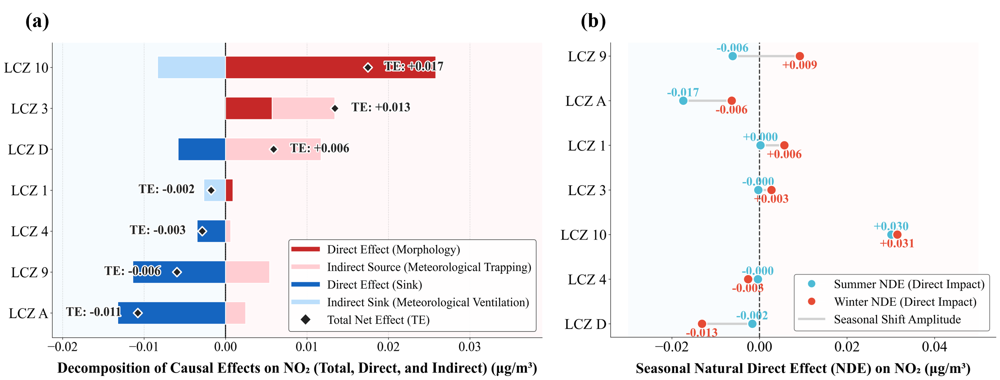

# Decoupling the Direct and Indirect Effects of Local Climate Zones on NO₂ Dynamics across the Beijing–Tianjin–Hebei Region

This repository contains the data and code accompanying the research: **Decoupling the Direct and Indirect Effects of Local Climate Zones on NO₂ Dynamics across the Beijing–Tianjin–Hebei Region**.

## Methodology Overview

The framework integrates:

1. **Multi-Source Atmospheric and Urban Feature Fusion**: A unified 100 m feature space is constructed by integrating **Sentinel-5P TROPOMI NO₂**, **GEOS-CF atmospheric reanalysis**, **Local Climate Zones (LCZs)**, **AlphaEarth Embedding Features (AEF)**, meteorological variables, and anthropogenic activity indicators. GEOS-CF is incorporated to reconstruct temporally continuous NO₂ fields and alleviate cloud-induced missing observations.

2. **High-Resolution NO₂ Mapping Framework**: An XGBoost-based downscaling framework is developed to reconstruct annual and seasonal NO₂ concentrations at 100 m spatial resolution. The framework integrates atmospheric chemistry constraints, urban morphology descriptors, meteorological interactions, and semantic embedding representations. Model robustness is evaluated using random sample-based validation, spatial cross-validation, temporal cross-validation, and Leave-One-City-Out (LOCO) validation.

3. **Explainable Attribution and Causal Decoupling**: SHAP (SHapley Additive exPlanations) is first employed to identify nonlinear statistical relationships between LCZs and atmospheric pollution. Subsequently, **Double Machine Learning (DML)** and **Causal Mediation Analysis (CMA)** are introduced to disentangle:
   - **Natural Direct Effects (NDE)** caused by intrinsic source–sink and aerodynamic effects of urban morphology.
   - **Natural Indirect Effects (NIE)** mediated through urban heat island (UHI), turbulence enhancement, and boundary-layer modification.

4. **Counterfactual Urban Renewal Simulation**: A counterfactual simulation framework is constructed to evaluate NO₂ responses under hypothetical LCZ conversion scenarios (e.g., Compact High-rise → Open High-rise, Heavy Industry → Urban Vegetation). The framework quantifies seasonal source–sink transitions, spatial heterogeneity of mitigation benefits, and morphology-dependent nonlinear responses.



## Data Source

The framework integrates atmospheric observations, urban morphology descriptors, meteorological reanalysis, and auxiliary geographic datasets.

### 1. Atmospheric Observation Data

Used for NO₂ reconstruction and atmospheric constraint.

* **Sentinel-5P TROPOMI NO₂**: Tropospheric NO₂ column density observations for atmospheric pollution reconstruction, sourced from [Google Earth Engine Data Catalog](https://developers.google.com/earth-engine/datasets/catalog/COPERNICUS_S5P_OFFL_L3_NO2).

* **NASA GEOS-CF**: Simulated atmospheric composition and meteorological fields used for NO₂ gap filling and atmospheric correction, sourced from [Google Earth Engine Data Catalog](https://developers.google.com/earth-engine/datasets/catalog/NASA_GEOS-CF_v1_rpl_tavg1hr).

* **CHAP Dataset**: 1 km ground-level NO₂ dataset used as auxiliary atmospheric reference, available at [Zenodo](https://doi.org/10.5281/zenodo.15218546).

* **Ground Monitoring Stations**: Surface NO₂ observations for calibration and validation, sourced from [China National Environmental Monitoring Center (CNEMC)](https://www.cnemc.cn/).

---

### 2. Urban Morphology and Semantic Features

Used for urban form characterization and semantic representation.

* **Seasonal Local Climate Zones (LCZ)**: 10 m seasonally consistent LCZ maps derived from our previous study, representing urban surface structure and land-cover composition across different seasons. The dataset was generated using the AAEF-HMM coupled framework proposed in:
  *Seasonally Consistent Local Climate Zone Mapping via Annual AlphaEarth Embedding Features and Hidden Markov Modeling*.
  Dataset available at [Zenodo](https://doi.org/10.5281/zenodo.19393486).

  The seasonal LCZ product enables explicit characterization of intra-annual urban morphology dynamics and seasonal source–sink transitions in atmospheric pollution processes.

* **Google Satellite Embedding (V1)**: 10 m resolution. **64-dimensional Annual AlphaEarth Embedding Features (AEF)** derived from self-supervised learning, serving as stable semantic urban representations, sourced from [GEE Data Catalog](https://developers.google.com/earth-engine/datasets/catalog/GOOGLE_SATELLITE_EMBEDDING_V1_ANNUAL).

---

### 3. Meteorological Data

Used to characterize thermodynamic and boundary-layer processes.

* **ERA5-Land**: Provides meteorological variables including 2 m air temperature ($t_{2m}$), 10 m zonal wind ($u_{10}$), 10 m meridional wind ($v_{10}$), surface pressure (sp), and dew-point temperature (td), sourced from [Google Earth Engine Data Catalog](https://developers.google.com/earth-engine/datasets/catalog/ECMWF_ERA5_LAND_HOURLY).

* **ERA5**: Provides boundary-layer height (BLH) and surface solar radiation (SSR) for atmospheric stability characterization, sourced from [Google Earth Engine Data Catalog](https://developers.google.com/earth-engine/datasets/catalog/ECMWF_ERA5_HOURLY).

---

### 4. Auxiliary Data

Used to characterize anthropogenic intensity and geographic constraints.

* **SRTM DEM**: 30 m elevation data, sourced from [Google Earth Engine Data Catalog](https://developers.google.com/earth-engine/datasets/catalog/USGS_SRTMGL1_003).

* **ALOS DSM**: 30 m surface elevation data used to characterize urban vertical structure, sourced from [Google Earth Engine Data Catalog](https://developers.google.com/earth-engine/datasets/catalog/JAXA_ALOS_AW3D30_V4_1).

* **Landsat 8 Surface Reflectance**: Multi-spectral bands (B3, B4, B5, B6) used for surface characterization, sourced from [Google Earth Engine Data Catalog](https://developers.google.com/earth-engine/datasets/catalog/LANDSAT_LC08_C02_T1_L2).

* **OpenStreetMap (OSM)**: Vector road-network data used to derive road density and traffic intensity indicators, sourced from [OpenStreetMap](https://www.openstreetmap.org/).

* **WorldPop**: 100 m population density dataset, sourced from [WorldPop](https://hub.worldpop.org/geodata/listing?id=135).

* **VIIRS Nighttime Lights (NTL)**: 500 m nighttime light data representing anthropogenic activity intensity, sourced from [Google Earth Engine Data Catalog](https://developers.google.com/earth-engine/datasets/catalog/NOAA_VIIRS_DNB_MONTHLY_V1_VCMSLCFG).

## Project Structure

```text
├── .gitignore
├── LICENSE
├── README.md
├── requirements.txt
│
├─ codes/
│  ├─ Data_Preprocessing/
│  │  ├─ aef_pca.py
│  │  ├─ basefeature_matrix_export.js
│  │  ├─ gaussian_lcz_coverage_extract.py
│  │  ├─ geocf_gap_filling.py
│  │  └─ road_feature_extract.py
│  │
│  ├─ NO2_Mapping/
│  │  ├─ loco_cv.py
│  │  ├─ predict_100m_no2.py
│  │  ├─ sample_time_spatial_cv_validation.py
│  │  └─ train_xgboost_no2.py
│  │
│  ├─ Explainable_Attribution/
│  │  ├─ shap_dependence_plot.py
│  │  └─ shap_summary.py
│  │
│  ├─ Causal_Inference/
│  │  ├─ dag.r
│  │  ├─ double_machine_learning_nde.py
│  │  ├─ nde_nie_decomposition.py
│  │  └─ seasonal_effect.py
│  │
│  ├─ Counterfactual_Simulation/
│  │  └─ lcz_conversion_simulation.py
│
├─ datas/
│  ├─ BTH_feature_example.csv
│  ├─ Winter_LCZ_BTH_2024_100m.tif
│  ├─ BTH_NO2_Final_Downscale_RBF_v7.json
│  └─ BTH_NO2_Final_FeatureList_RBF_v7.joblib
│
│
├─ results/
│  ├─NO2.png
│  ├─lcz_boxplot.png
│  ├─shap_summary.png
│  └─ causal_combined.png
│
└─ images/
   └─ framework.png

## Step

The workflow is broken down into four main steps, corresponding to the methodological framework of the paper.

### Step 1: Multi-Source Data Fusion and Feature Construction

* **Platform**: Google Earth Engine (GEE) & Python

* **Code**:
    * [basefeature_matrix_export.js](codes/Data_Preprocessing/basefeature_matrix_export.js)
    * [road_feature_extract.py](codes/Data_Preprocessing/road_feature_extract.py)
    * [gaussian_lcz_coverage_extract.py](codes/Data_Preprocessing/gaussian_lcz_coverage_extract.py)
    * [aef_pca.py](codes/Data_Preprocessing/aef_pca.py)

This stage integrates multi-source atmospheric, urban morphology, meteorological, and anthropogenic datasets into a unified 100 m feature space.

The feature matrix consists of:

1. **Atmospheric Variables**: TROPOMI NO₂, GEOS-CF simulated NO₂, and CHAP ground-level NO₂.
2. **Urban Morphology Features**: Seasonal LCZ classes and Gaussian-weighted LCZ coverage fractions.
3. **Semantic Features**: 64-dimensional AlphaEarth Embedding Features (AAEF).
4. **Meteorological Variables**: ERA5 and ERA5-Land temperature, wind, humidity, boundary-layer height, and solar radiation.
5. **Anthropogenic Indicators**: Road density, nighttime lights, and population density.
6. **Topographic Constraints**: DEM and DSM variables.

All variables are resampled to a unified 100 m spatial grid before model training.

---

### Step 2: High-Resolution NO₂ Mapping

* **Platform**: Python

* **Code**:
    * [train_xgboost_no2.py](codes/NO2_Mapping/train_xgboost_no2.py)
    * [predict_100m_no2.py](codes/NO2_Mapping/predict_100m_no2.py)
    * [sample_time_spatial_cv_validation.py](codes/NO2_Mapping/sample_time_spatial_cv_validation.py)
    * [loco_cv.py](codes/NO2_Mapping/loco_cv.py)

An XGBoost-based downscaling framework is developed to reconstruct NO₂ concentrations at 100 m spatial resolution.

The framework combines:

- Satellite observations
- Atmospheric simulations
- Urban morphology descriptors
- Semantic embedding features
- Meteorological controls

Model robustness is assessed using:

1. Random sample-based validation
2. Spatial cross-validation
3. Temporal cross-validation
4. Leave-One-City-Out (LOCO) validation

The resulting NO₂ product provides fine-scale atmospheric pollution information across the Beijing–Tianjin–Hebei region.

---

### Step 3: Explainable Attribution and Causal Effect Decomposition

* **Platform**: Python & R

* **Code**:
    * [dag.r](codes/Causal_Inference/dag.r)
    * [double_machine_learning_nde.py](codes/Causal_Inference/double_machine_learning_nde.py)
    * [nde_nie_decomposition.py](codes/Causal_Inference/nde_nie_decomposition.py)
    * [seasonal_effect.py](codes/Causal_Inference/seasonal_effect.py)
    * [shap_summary.py](codes/Explainable_Attribution/shap_summary.py)
    * [shap_dependence_plot.py](codes/Explainable_Attribution/shap_dependence_plot.py)

SHAP is first employed to identify nonlinear relationships between LCZ morphology and NO₂ concentrations.

Subsequently, a causal framework combining Double Machine Learning (DML) and Causal Mediation Analysis (CMA) is constructed.

The framework decomposes LCZ effects into:

1. **Natural Direct Effects (NDE)**

   Effects associated with intrinsic source–sink processes, aerodynamic roughness, and ventilation resistance induced by urban morphology.

2. **Natural Indirect Effects (NIE)**

   Effects mediated through urban heat island (UHI), thermal turbulence, and boundary-layer modifications.

This approach explicitly separates morphology-driven pollution accumulation from meteorologically induced pollutant dilution.

---

### Step 4: Counterfactual Urban Renewal Simulation

* **Platform**: Python

* **Code**:
    * [lcz_conversion_simulation.py](codes/Counterfactual_Simulation/lcz_conversion_simulation.py)

Counterfactual LCZ conversion experiments are conducted to evaluate NO₂ responses under hypothetical urban-renewal pathways.

Representative scenarios include:

1. Compact High-rise → Open High-rise
2. Compact Mid-rise → Open Mid-rise
3. Heavy Industry → Urban Vegetation
4. Impervious Surface → Green Infrastructure

The framework quantifies:

- Seasonal source–sink transitions
- Net mitigation benefits
- Spatial heterogeneity of intervention effectiveness
- Direct and indirect pathway contributions

These simulations provide quantitative support for climate-sensitive urban planning and pollution mitigation strategies.

---

## Key Results

The proposed framework produces:

1. High-resolution (100 m) NO₂ maps across the Beijing–Tianjin–Hebei region.
2. SHAP-based nonlinear attribution of urban morphology effects.
3. Seasonal Natural Direct Effects (NDE) and Natural Indirect Effects (NIE) for each LCZ category.
4. Source–sink transition diagnostics across seasons.
5. Counterfactual NO₂ response maps under alternative urban-renewal scenarios.

## Visualization Examples





