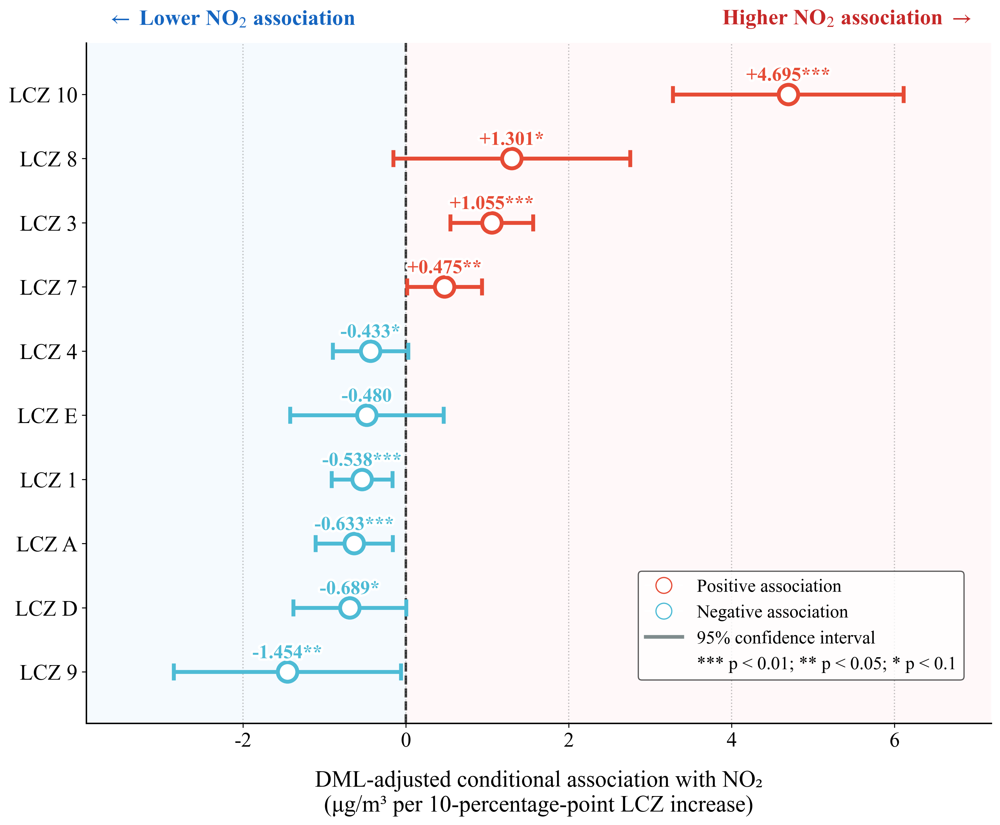
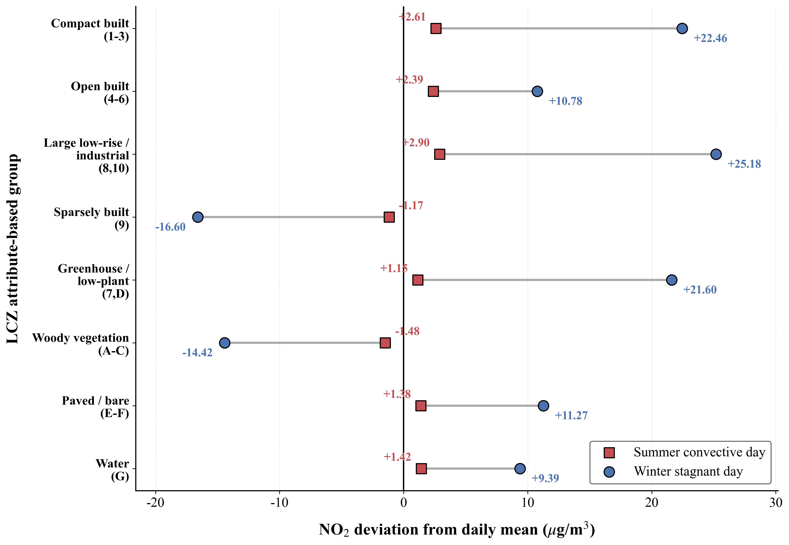
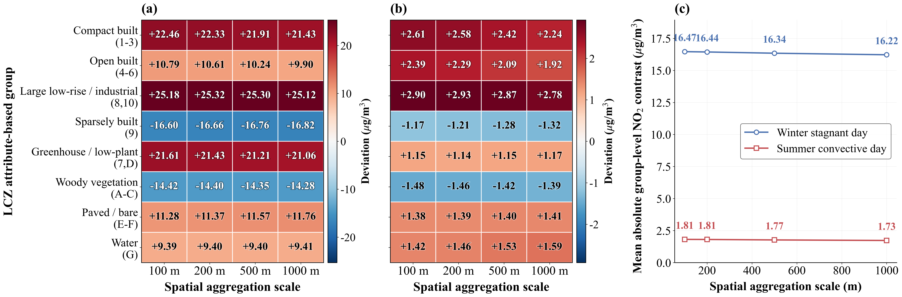

# Distinguishing LCZ Concentration Patterns from DML-Adjusted Urban-Environment Associations for 100-m Near-Surface NO₂ in the Beijing–Tianjin–Hebei Region

This repository contains the code and example data accompanying the study:

**Distinguishing LCZ Concentration Patterns from DML-Adjusted Urban-Environment Associations for 100-m Near-Surface NO₂ in the Beijing–Tianjin–Hebei Region**

The repository provides a reproducible workflow for constructing 100-m near-surface NO₂ maps, interpreting LCZ-related concentration patterns, and estimating DML-adjusted LCZ-composition signals after adjustment for observed urban-background covariates.

## Methodology Overview

The framework integrates four main components:

1. **Multi-source atmospheric and urban feature fusion**  
   A unified 100-m feature space is constructed by integrating Sentinel-5P TROPOMI NO₂, GEOS-CF simulations, seasonal Local Climate Zones (LCZs), AlphaEarth Foundations embeddings (AEF), meteorological variables, road-source proxies, population, nighttime lights, and terrain variables. GEOS-CF is used as a prior background for reconstructing cloud-contaminated TROPOMI gaps through RBF-guided reconstruction.

2. **High-resolution near-surface NO₂ mapping**  
   An XGBoost-based mapping framework is developed to estimate near-surface NO₂ concentrations at 100-m spatial resolution. Model robustness is evaluated using sample-based cross-validation, spatial cross-validation, temporal cross-validation, Leave-One-City-Out (LOCO) validation, and comparison with the independent 1-km CHAP product after spatial aggregation.

3. **Predictive attribution and DML-adjusted LCZ-composition analysis**  
   SHAP is used as a diagnostic tool to identify important predictors and nonlinear response patterns within the NO₂ mapping model. Double Machine Learning (DML) is then used to estimate covariate-adjusted conditional LCZ-composition associations. The DML adjustment set includes spatiotemporal background, terrain, observed meteorological dispersion conditions, road-source proxies, population, and nighttime light intensity. The estimates are reported as the change in NO₂ concentration associated with a 10-percentage-point increase in LCZ coverage.

4. **Nonlinear, attribute-grouped, multi-scale, and scenario analyses**  
   Additional analyses examine nonlinear LCZ coverage responses, representative-day LCZ attribute-group anomalies, multi-scale stability of attribute-group contrasts from 100 m to 1000 m, and an LCZ-composition scenario simulation. The scenario simulation is interpreted as a structural sensitivity analysis within the trained mapping framework, not as a fully specified redevelopment prediction.


## Data Sources

The framework integrates atmospheric observations, urban morphology descriptors, meteorological reanalysis, and auxiliary geographic datasets.

### 1. Atmospheric Observation and Benchmark Data

Used for NO₂ reconstruction, model training, and independent spatial comparison.

* **Sentinel-5P TROPOMI NO₂**: Tropospheric NO₂ column density observations for atmospheric pollution reconstruction, sourced from [Google Earth Engine Data Catalog](https://developers.google.com/earth-engine/datasets/catalog/COPERNICUS_S5P_OFFL_L3_NO2).

* **NASA GEOS-CF**: Simulated atmospheric composition fields used as prior background information for TROPOMI NO₂ gap reconstruction, sourced from [Google Earth Engine Data Catalog](https://developers.google.com/earth-engine/datasets/catalog/NASA_GEOS-CF_v1_rpl_tavg1hr).

* **CHAP Dataset**: Independent 1-km ground-level NO₂ dataset used as an external gridded benchmark for spatial pattern consistency, available at [Zenodo](https://doi.org/10.5281/zenodo.15218546).

* **Ground Monitoring Stations**: Hourly surface NO₂ observations from the China National Environmental Monitoring Centre (CNEMC), used for model calibration and validation.

---

### 2. Urban Morphology and Semantic Features

Used for urban physical-environment characterization and surface-context representation.

* **Seasonal Local Climate Zones (LCZs)**: 10-m seasonally consistent LCZ maps derived from our previous study, representing urban surface structure, canopy morphology, and land-cover composition across seasons. The dataset was generated using an AEF-HMM coupled framework and is available at [Zenodo](https://doi.org/10.5281/zenodo.19393486).

* **AlphaEarth Foundations Embeddings (AEF)**: 10-m, 64-dimensional annual deep latent embeddings derived from Google Satellite Embedding V1, used as stable semantic representations of land-surface context, sourced from [Google Earth Engine Data Catalog](https://developers.google.com/earth-engine/datasets/catalog/GOOGLE_SATELLITE_EMBEDDING_V1_ANNUAL).

---

### 3. Meteorological Data

Used to characterize regional atmospheric background and boundary-layer dispersion conditions.

* **ERA5-Land**: Provides 2-m air temperature, 10-m zonal and meridional wind components, surface pressure, and dew-point temperature, sourced from [Google Earth Engine Data Catalog](https://developers.google.com/earth-engine/datasets/catalog/ECMWF_ERA5_LAND_HOURLY).

* **ERA5**: Provides boundary-layer height and surface downward shortwave radiation for atmospheric dispersion characterization, sourced from [Google Earth Engine Data Catalog](https://developers.google.com/earth-engine/datasets/catalog/ECMWF_ERA5_HOURLY).

---

### 4. Auxiliary Data

Used to characterize terrain, road-source proximity, and anthropogenic activity intensity.

* **SRTM DEM**: 30-m elevation data, sourced from [Google Earth Engine Data Catalog](https://developers.google.com/earth-engine/datasets/catalog/USGS_SRTMGL1_003).

* **ALOS DSM**: 30-m surface elevation data used to characterize surface height and urban vertical structure, sourced from [Google Earth Engine Data Catalog](https://developers.google.com/earth-engine/datasets/catalog/JAXA_ALOS_AW3D30_V4_1).

* **OpenStreetMap (OSM)**: Vector road-network data used to derive Euclidean distance to roads and multi-scale Gaussian road-density proxies, sourced from [OpenStreetMap](https://www.openstreetmap.org/).

* **WorldPop**: 100-m population dataset, sourced from [WorldPop](https://hub.worldpop.org/geodata/listing?id=135).

* **VIIRS Nighttime Lights (NTL)**: 500-m nighttime light data representing anthropogenic activity intensity, sourced from [Google Earth Engine Data Catalog](https://developers.google.com/earth-engine/datasets/catalog/NOAA_VIIRS_DNB_MONTHLY_V1_VCMSLCFG).

## Project Structure

```text
├── .gitignore
├── LICENSE
├── README.md
├── requirements.txt
│
├─ codes/
│  ├─ Data_Preprocessing/
│  │  ├─ aef_pca.py
│  │  ├─ basefeature_matrix_export.js
│  │  ├─ gaussian_lcz_coverage_extract.py
│  │  ├─ geos_cf_rbf_gap_reconstruction.py
│  │  └─ road_feature_extract.py
│  │
│  ├─ NO2_Mapping/
│  │  ├─ loco_cv.py
│  │  ├─ predict_100m_no2.py
│  │  ├─ sample_time_spatial_cv_validation.py
│  │  └─ train_xgboost_no2.py
│  │
│  ├─ Explainable_Attribution/
│  │  ├─ shap_dependence_plot.py
│  │  └─ shap_summary.py
│  │
│  ├─ DML_LCZ_Association/
│  │  ├─ dml_adjusted_lcz_estimates.py
│  │  ├─ dml_nonlinear_lcz_response.py
│  │  ├─ lcz_attribute_group_anomaly.py
│  │  └─ lcz_multiscale_stability.py
│  │
│  ├─ LCZ_Scenario_Simulation/
│  │  └─ lcz1_to_lcz4_scenario_simulation.py
│
├─ datas/
│  ├─ BTH_feature_example.csv
│  ├─ Winter_LCZ_BTH_2024_100m.tif
│  ├─ BTH_NO2_Final_Downscale_RBF_v7.json
│  └─ BTH_NO2_Final_FeatureList_RBF_v7.joblib
│
├─ results/
│  ├─ NO2.png
│  ├─ lcz_boxplot.png
│  ├─ shap_summary.png
│  ├─ dml_lcz_estimates.png
│  ├─ lcz_group_anomaly.png
│  ├─ lcz_multiscale_stability.png
│  └─ scenario_simulation.png
│
└─ images/
   └─ framework.png
```

## Workflow

The workflow is broken down into four main steps, corresponding to the methodological framework of the paper.

### Step 1: Multi-source data fusion and feature construction

* **Platform**: Google Earth Engine (GEE) and Python

* **Code**:
    * [basefeature_matrix_export.js](codes/Data_Preprocessing/basefeature_matrix_export.js)
    * [road_feature_extract.py](codes/Data_Preprocessing/road_feature_extract.py)
    * [gaussian_lcz_coverage_extract.py](codes/Data_Preprocessing/gaussian_lcz_coverage_extract.py)
    * [aef_pca.py](codes/Data_Preprocessing/aef_pca.py)
    * [geos_cf_rbf_gap_reconstruction.py](codes/Data_Preprocessing/geos_cf_rbf_gap_reconstruction.py)

This step integrates multi-source atmospheric, urban morphology, meteorological, road-source, socioeconomic, and terrain datasets into a unified 100-m feature matrix.

The feature matrix includes:

1. **Atmospheric variables**: reconstructed TROPOMI NO₂, GEOS-CF NO₂, and the TROPOMI-BLH ratio.
2. **Urban physical-environment features**: seasonal LCZ classes and Gaussian-weighted LCZ coverage fractions.
3. **Semantic surface-context features**: AlphaEarth Foundations principal components.
4. **Meteorological and dispersion variables**: ERA5 and ERA5-Land temperature, wind, humidity, boundary-layer height, shortwave radiation, and ventilation index.
5. **Road-source and anthropogenic indicators**: road distance, multi-scale road-density proxies, nighttime lights, and population.
6. **Terrain variables**: DEM and DSM.

All variables are resampled or aggregated to a unified 100-m spatial grid before model training.

---

### Step 2: 100-m near-surface NO₂ mapping and validation

* **Platform**: Python

* **Code**:
    * [train_xgboost_no2.py](codes/NO2_Mapping/train_xgboost_no2.py)
    * [predict_100m_no2.py](codes/NO2_Mapping/predict_100m_no2.py)
    * [sample_time_spatial_cv_validation.py](codes/NO2_Mapping/sample_time_spatial_cv_validation.py)
    * [loco_cv.py](codes/NO2_Mapping/loco_cv.py)

An XGBoost-based mapping framework is used to estimate near-surface NO₂ concentrations at 100-m spatial resolution.

Model robustness is assessed using:

1. Sample-based cross-validation
2. Spatial cross-validation
3. Temporal cross-validation
4. Leave-One-City-Out validation
5. Aggregated comparison with the independent CHAP 1-km product

The resulting 100-m NO₂ surface provides the outcome variable for subsequent LCZ-composition association analysis.

---

### Step 3: Predictive attribution and DML-adjusted LCZ-composition analysis

* **Platform**: Python

* **Code**:
    * [shap_summary.py](codes/Explainable_Attribution/shap_summary.py)
    * [shap_dependence_plot.py](codes/Explainable_Attribution/shap_dependence_plot.py)
    * [dml_adjusted_lcz_estimates.py](codes/DML_LCZ_Association/dml_adjusted_lcz_estimates.py)
    * [dml_nonlinear_lcz_response.py](codes/DML_LCZ_Association/dml_nonlinear_lcz_response.py)

SHAP is first used as a diagnostic tool to interpret the fitted XGBoost mapping model. It identifies important predictors and nonlinear response patterns, but it is not interpreted as an adjusted LCZ effect.

DML is then used to estimate covariate-adjusted conditional LCZ-composition associations. For each LCZ category, the treatment variable is the Gaussian-weighted LCZ coverage fraction, and the outcome variable is the mapped 100-m near-surface NO₂ concentration.

The DML adjustment set includes:

1. Spatiotemporal background variables: year, month, and day of year
2. Terrain variables: DEM and DSM
3. Observed meteorological dispersion variables: wind speed, wind-direction components, temperature, surface pressure, relative humidity, boundary-layer height, shortwave radiation, and ventilation index
4. Road-source proxies: distance to roads and multi-scale Gaussian road-density variables
5. Population
6. Nighttime light intensity

The resulting estimates are reported as DML-adjusted LCZ-composition signals per 10-percentage-point increase in LCZ coverage.

Important interpretation:

* Positive values indicate higher residual NO₂ association after adjustment for observed background covariates.
* Negative values indicate lower residual NO₂ association after adjustment for observed background covariates.
* The estimates are interpreted as conditional LCZ-composition associations, not as complete causal pathways or natural direct/indirect effects.
* Outcome-like pollution-background variables are not included in the main DML adjustment set to avoid over-adjusting the mapped NO₂ outcome.

---

### Step 4: LCZ attribute-group, multi-scale, and scenario analyses

* **Platform**: Python

* **Code**:
    * [lcz_attribute_group_anomaly.py](codes/DML_LCZ_Association/lcz_attribute_group_anomaly.py)
    * [lcz_multiscale_stability.py](codes/DML_LCZ_Association/lcz_multiscale_stability.py)
    * [lcz1_to_lcz4_scenario_simulation.py](codes/LCZ_Scenario_Simulation/lcz1_to_lcz4_scenario_simulation.py)

LCZ classes are grouped into broader physical-environment categories, including compact built, open built, large low-rise/industrial, sparsely built, greenhouse/low-plant transitional, woody vegetation, paved/bare, and water.

The analysis includes:

1. **Representative-day attribute-group anomalies**  
   Group-level NO₂ deviations are calculated relative to the daily regional mean under a winter stagnant day and a summer convective day.

2. **Multi-scale stability analysis**  
   LCZ attribute-group deviations are evaluated after aggregating the 100-m grids to 200 m, 500 m, and 1000 m spatial units.

3. **LCZ-composition scenario simulation**  
   A partial LCZ 1 to LCZ 4 conversion scenario is used to assess the sensitivity of model-predicted NO₂ to a compact-to-open high-rise composition change. This analysis is interpreted as a structural sensitivity test within the trained mapping framework.

---

## Key Results

The proposed framework produces:

1. A validated 100-m near-surface NO₂ mapping product for the Beijing–Tianjin–Hebei region.
2. SHAP-based diagnostic attribution of regional pollution background, meteorological dispersion, and LCZ-related predictors.
3. DML-adjusted LCZ-composition signals that distinguish descriptive concentration rankings from adjusted LCZ associations.
4. A key contrast showing that compact high-rise districts have high observed NO₂ concentrations but a negative DML-adjusted LCZ signal.
5. Strong positive adjusted signals for heavy industry and large low-rise / compact low-rise environments.
6. Winter-amplified and scale-stable LCZ attribute-group contrasts across 100-m to 1000-m spatial aggregation scales.
7. A structural LCZ-composition scenario simulation for assessing the sensitivity of predicted NO₂ to compact-to-open high-rise transformation.

## Visualization Examples









## License

This repository is released for academic and non-commercial research use. Please check the licenses of the original datasets before redistribution.
